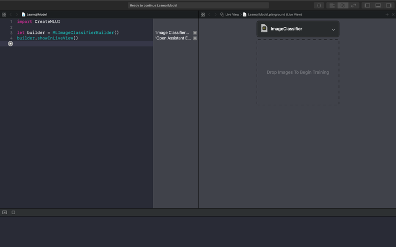
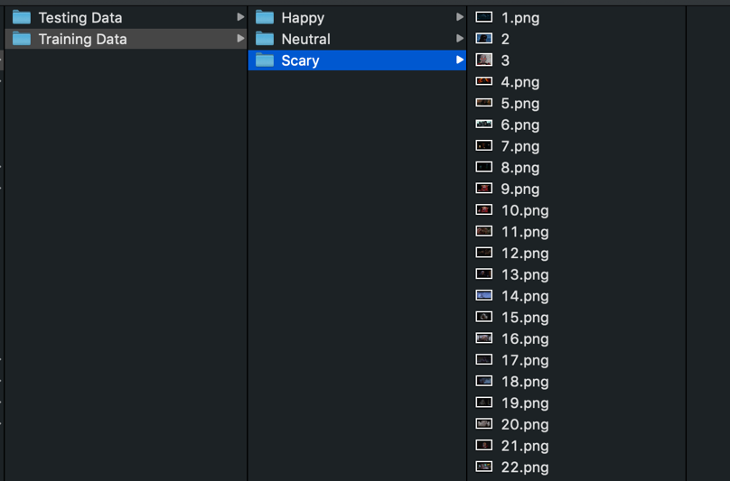
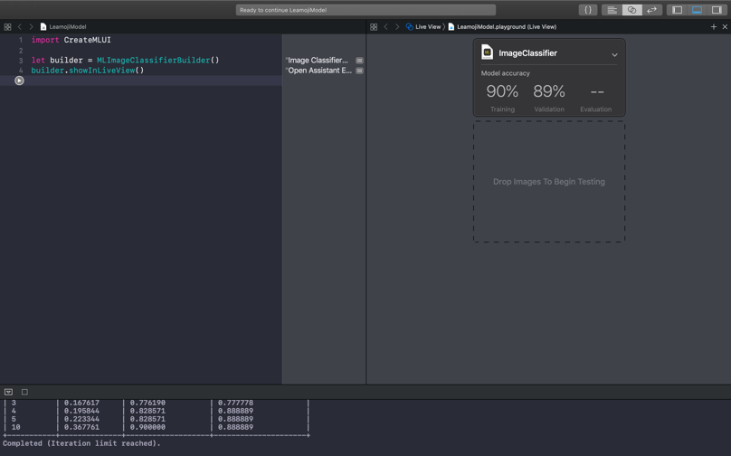
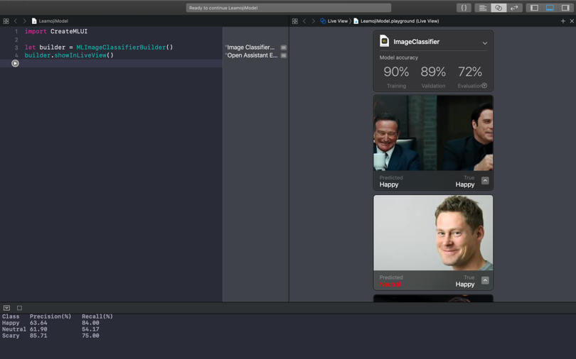
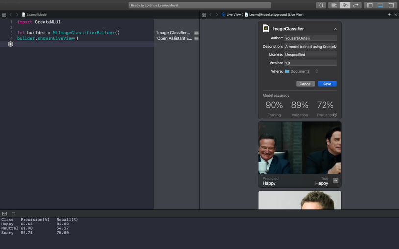
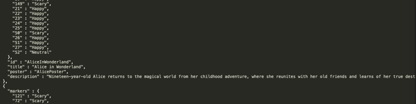

# Technical Documentation & Manual Leamoji


Name: Youssra Outelli  
Date: 20 november 2018  
Profession: iOS intern  
Company: Disney Streaming Services  

# Table of Contents
### Section 1 - Project Description
##### Purpose of the project
##### Result

### Section 2 - CoreML Model
##### CreateML
##### Insert data

### Section 3 - Decode & Encode JSON
##### Why?
##### Decoding
##### Encoding

### Section 4 - Collection View
##### Delegate Flow Layout 
##### Populate Collection View
##### Segue

### Section 5 - Video Detail Screen
##### Display Data
##### Play Video

### Section 6 - Emoji Logic
##### Getting images
##### Converting image to pixelbuffer
##### Prepare model
##### Run model
##### Encode outcome model

### Section 7 - Displaying emoji
##### Time Observer
##### Handle Time Observer
##### Display emoji

### Bitbucket link 


## Section 1 - Project Description 
In this section I'll be discussing what the purpose is of this project and what the final result will be after 4 weeks. 

#### Purpose of the project
The purpose of this project is to protect and make children more aware of what's to come in a movie or show that they’re watching. How I want to do this is to develop a model that analyzes a video on the emotions shown in the scenes, and based on the emotion show an emoji in the video player. The emoji in the video player gives children a heads up of what to come. 

#### Result
The result of this project after 4 weeks is an iOS app with a video player that shows an emoji based on the scene of a movie or show that’s being played. 

## Section 2 - CoreML Model
In this section I’ll explain how to train your own CoreML model using CreateML and how to implement that in the app. 

#### CreateML
There are a lot of different tools and services to build your own CoreML model. For example, with CreateML in Xcode 10, Turi Create and IBM Watson Services. In this project I’ve chosen for CreateML in Xcode 10. 

You can create your own CoreML model by using a playground file in Xcode 10. With just 3 lines of code and the Live View of playground you could easily train your model. Paste these 3 lines in the file and open the live viewer: 

```
import CreateMLUI

let builder = MLImageClassifierBuilder()
builder.showInLiveView()
```

Run this code and you’ll see this menu in the Live View: 


#### Insert data
Now that you have the playground setup, it’s time to train the model. This is the setup of the folder for the training data and the testing data. 

In the folders Training Data and Testing Data, you should have subfolders of the emotions you would like to train. In this case it’s: Happy, Neutral and Scary. In those subfolders is the actual data that CreateML will be using to train and then test the model. The filenames of these images should be the number in ascending order.



It's important to keep in mind that images in the training data should not be in the testing data. So, the testing data should consist of images that the model has never seen. 

It's also important to make sure that you have as many different images as possible. For example, if you make an image classifier that classifies tigers. You should have images of different species or of different surroundings or light (dayligt or at night). The images should be as diverse as possible so you could train the model better. 

Now that you have your data structured correctly, you can drag the Training Data folder in the live view. CreateML will now analyze the data and output 2 percentages to represent the model accuracy. The first one is the training percentage. The training percentage represents the percentage of amount that the model could train. When you input the training data, CreateML uses a small percentage of that data for testing. The outcome of that is the validation percentage. Because the model tests on its own training data, the validation percentage is mostly as high as the training percentage. So, the percentages report how well the trained model
classifies images from the image sets. 

_The percentages displayed in the screen below are not a guarantee for your model._


Now it’s time to enter the testing data. You do this the same as the Training Data, drop the entire folder in the live view to begin testing. 

After the model is done testing, it will output a percentage as well as all the images it tested with the prediction and the actual outcome. 

_The percentages displayed in the screen below are not a guarantee for your model._


Now that the model is done training and testing the images. You can now save the model in the folder of your preferences for later use in the project. 



You have now trained your own CoreML model using CreateML in a playground file. 

## Section 3 - Decode & Encode JSON
In this section I’ll explain how I’ve implemented encoding and decoding JSON to use in the app. 

#### Why?
First, I’ll explain why I chose to use JSON in this app. For this app, you need movies and information about these movies. I’m not getting the information of these movies from an external server or by using an API. The easiest way was to have a local JSON file in the bundle of the app, with all the information about the movies. The reason this is the easiest way is because if your encoding & decoding is done properly, you'll always see the information. Where if you get the JSON from an external server, you're also dealing with networking. This application is not dependent of network. So, the information that is located in the JSON file is accessible at all time. 

For this project, I use 2 versions of the MovieData.json file. One is located in the bundle of the project and this will only get used to read from and display data in the collection view, that I’ll explain in the next section. The other JSON file is used to write to and this is stored on the actual device. The reason this is getting stored on the device is because of the scope and the timeframe of this project. 

Now, I store 5 properties in a JSON file called: MovieData.json. The 5 properties are: id, title, description, poster and markers. The id has 2 uses, the name of the movie and the name of the video files. See below: 



#### Decoding
For this project I use Swift's default JSON encoding and decoding functions.

I have one file where I do the decoding of the JSON file, called MovieParser.swift. Because I have 2 versions of the JSON file, I also have 2 different functions that addresses the different files. The only difference between the 2 functions is where they retrieve the file from. 

For example, the function getData() decodes the JSON file that is located in the bundle and returns an array of a Movie struct where the information gets stored for later use.

```
  static func getData() throws -> [Movie] {
    
    guard let url = Bundle.main.url(forResource: "MovieData", withExtension: "json") else {
      assertionFailure("couldn't find url of MovieData.json")
      return []
    }
    
    do {
      guard let data = try? Data(contentsOf: url) else {
        assertionFailure("couldn't fetch content of url")
        return []
      }
      
      let decoder = JSONDecoder()
      let movies = try decoder.decode([Movie].self, from: data)
      
      return movies
    } catch let error {
      print("Retrieve failed: URL: '\(url))', Error: '\(error)'")
      throw error
    }
  }
```

#### Encoding
Encoding only happens in one part of the app and that is when the model has run its predictions on a video and outputs the markers with the corresponding class label. And this gets encoded in the MovieData.json file and get stored on the actual device. To display the information better in the JSON file I use: 

```encoder.outputFormatting = [.prettyPrinted, .sortedKeys]```

This is to make sure that in the JSON file that gets stored on the actual device, you can see the information displayed below each other instead of on 1 line. 

```
 func write(json: [Movie]) {
      let filename = getDocumentsDirectory().appendingPathComponent("MovieData.json")
      
      do {
        let encoder = JSONEncoder()
        encoder.outputFormatting = [.prettyPrinted, .sortedKeys]
        
        guard let data = try? encoder.encode(json) else {
          assertionFailure("couldn't encode json data")
          return
        }
        
        try String(data: data, encoding: .utf8)?.write(to: filename, atomically: true, encoding: String.Encoding.utf8)
      } catch let error {
        print(error)
        assertionFailure("failed to write file")
      }
    }
  }
  
  func getDocumentsDirectory() -> URL {
    
    let paths = FileManager.default.urls(for: .documentDirectory, in: .userDomainMask)
    return paths[0]
  }
```


## Section 4 - Collection View
In this section I’ll explain how I use the collection view to display all the movies and make sure that when you press on a certain movie the data persists to the next screen. 

#### Populate Collection View
For populating the collection view I use the information from the MovieData.json file that is located in the bundle of the project. I have declared a public variable called loadedData to store an array of the Movie struct which contains all the information from the MovieData.json file. 

So, now the information is loaded in the variable. You can use the variable to determine how many items should be in a section. This is: 

```
loadedData.count
```

This counts all the properties in the JSON file and displays the cells based on the count.  

After we’ve determined how many cells you need, it’s time to actually fill the cell with the image from the JSON file. We use the ```collectionView(_:cellForItemAt:)```. In this function we’ll start by making a cell. In a collection view every cell is being reused if one is available and otherwise it makes a new one. 

After we’ve made our cell. It’s now time to populate that cell with the movie poster from the JSON file. In the JSON file the URL from the movie poster is located, where as the actual image is stored in the assets folder inside of your bunlde. So, we have all the information in the loadedData variable, so instead of using all the information located in there we only extract the one that we need, movie poster. For that we make a new variable called posterUrl in which we store only the movie poster. 

```
  func collectionView(_ collectionView: UICollectionView, numberOfItemsInSection section: Int) -> Int {
    
    return loadedData.count
  }
  
  func collectionView(_ collectionView: UICollectionView, cellForItemAt indexPath: IndexPath) -> UICollectionViewCell {
    
    guard let myCell = collectionView.dequeueReusableCell(withReuseIdentifier: "cellIdentifier", for: indexPath) as? CollectionViewCell
      else {
        assertionFailure("couldn't make myCell")
        return UICollectionViewCell()
    }
    
    let posterUrl = loadedData[indexPath.row].poster
    myCell.moviePoster.image = UIImage(named: posterUrl)
    
    return myCell
  }
```


#### Delegate Flow Layout
In this application I have used the delegate flow layout to determine how the cells are laid out in the collection view including how big the size must be for every cell and the spacing between them.

The first function I used is called the ```collectionView(_:layout:sizeForItemAt:)```. This function determines how big each cell needs to be. The calculation that I’ve made is I first start with how much width is available. And this is the entire width of the frame minus the guttersize (the space between every cell) multiplied by items per row that I want to have. That’s the entire width that is available on the screen. 
Now to determine what the width is of each cell, you have to divide this available width to the items per row. The outcome of this is the width of every cell, but you also need the height. 
To determine the height, you take the width that we just calculated and divide this by the aspect ratio of an image that you have. One of the images that I have in the bundle is 151 by 227. It doesn’t matter which image size you use because you only need the aspect ratio. So, now to calculate the height, we divide the width by the aspect ratio of the image. 

Another function that I use is ```collectionView(_:layout:insetForSectionAt:)```. This function determines the margins to apply to the cells. I already specified in a variable, called gutterSize, that I want this margin to be 10 pixels. So, in this function we only return the edge insets and for each corner we use the gutter size.

Last but not least we have the function ```collectionView(_:layout:minimumLineSpacingForSectionAt:)```. This function specifies the minimum spacing to use between lines of items in the collection view. For this function we also return the already specified guttersize. See screenshot below for implementations of all functions. 


```
  func collectionView(_ collectionView: UICollectionView, layout collectionViewLayout: UICollectionViewLayout, sizeForItemAt indexPath: IndexPath) -> CGSize {
    
    let availableWidth = collectionView.frame.width - gutterSize * (itemsPerRow + 1)
    let width  = availableWidth / itemsPerRow
    let height = width / (151 / 227)
    
    return CGSize(width: width, height: height)
  }
  
  func collectionView(_ collectionView: UICollectionView, layout collectionViewLayout: UICollectionViewLayout, insetForSectionAt section: Int) -> UIEdgeInsets {
    
    return UIEdgeInsets(top: gutterSize, left: gutterSize, bottom: gutterSize, right: gutterSize)
  }
  
  func collectionView(_ collectionView: UICollectionView, layout collectionViewLayout: UICollectionViewLayout, minimumLineSpacingForSectionAt section: Int) -> CGFloat {
    
    return gutterSize
  }
```

#### Segue
Now we have displayed the movie posters and they all have their own cell, it’s time to persist the selected movie with all the information to the next screen. We do that by using the function ```prepare(for:sender:)```. In this function we make 2 variables. One for the selected index of the movie poster and the other to determine the target, which is the destination of this segue. Once we have those 2 variables set, it’s just a matter of assigning the loadedData for that selected index to the target. Here is how that’s done: 

```
 override func prepare(for segue: UIStoryboardSegue, sender: Any?) {
    
    guard let selectedIndex = collectionViewList.indexPathsForSelectedItems?.first,
      let target = segue.destination as? VideoDetailViewController
      else { return }
    
    target.movie = loadedData[selectedIndex.row]
  }
```


## Section 5 - Video Detail Screen] 
In this section I’ll discuss how I implemented the video detail screen. On the video detail screen, you’ll see the movie poster, title, description and a play button to direct you to the actual movie. 

#### Display Data
In the collection view we had a function that persists the data from the selected movie to the video detail screen. That data was stored in a variable called movie. So, now in the video detail screen we can assign the IBOutlets of every property to the part of the movie data that we need. We do this in a function called passedData. For example, I set the title of the movie by assigning the titleLabel.text to the movie.title. And so on for every property that we need. 

```
 titleLabel.text = movie.title
    movieImage.image = UIImage(named: movie.poster)
    descriptionLabel.text = movie.description
```

If you run this, you’ll see that every video detail screen is filled with the data from the selected movie in the collection view. 

#### Play video
In the video detail view controller, we also have an IBAction called playVideo. This is the function that controls the play button. Inside this function we get the video url that is located inside of our bundle. And after we’ll start the EmojiAVPlayerViewController. We’ll discuss this class later. The EmojiAVPlayerViewController conforms to AVPlayerViewController. And that is class made by Apple to display video content from a player along with playback controls. 

Now to start the video we assign a variable to the EmojiAVPlayerViewController. And assign this variable again to the movie that we persisted in the collection view. Now that we’ve set these variables we call the present function that presents the video player. 

```
  @IBAction func playVideo(_ sender: UIButton) {
    
    guard let videoURL = Bundle.main.url(forResource: movie?.id, withExtension: "mp4") else {
      assertionFailure("wrong url")
      return
    }
    
    let player = AVPlayer(url: videoURL)
    let vc = EmojiAVPlayerViewController()
    
    vc.player = player
    vc.movie = movie
    
    present(vc, animated: true, completion: nil)
  }
```

## Section 6 - Emoji Logic 
In this section I’ll explain everything about how the model works its prediction and how I handle this for further use in the video player. This is all done in a file called EmoijLogic.swift. 

#### Getting images 
There a lot of ways to extract frames out of a video and store them. For this project I used ffmpeg on commandline to extract the frames. It’s possible to write a script to do this automatically but for the scope of this project I’ve done it manually and stored them in a folder with the same name as the id. In a function called checkFrames, I extract those frames from the folder into a variable called images for later use. 

#### Converting images to pixelbuffer
Before we can run the model on the images that we extracted from the folders (see above paragraph for explanation), we need to first convert a UIImage to a CVPixelBuffer. The reason for this is that the model only accepts a CVPixelBuffer as input. 

#### Prepare model
Now that we have the images extracted and the images converted to something the model accepts. It’s time to run the model. We do this in a function called emojiType that takes in an image and outputs an EmojiType. EmojiType is an enumeration of all the possible cases with the classLabel and the corresponding emoji. In the function we have a variable called prediction. In this variable the actual prediction gets acquired by using the prediction function from the model. After that I specified 2 outcomes. If the pixelbuffer couldn’t be made the outcome is a neutral emoji. But also, if the prediction couldn’t classify the image as either happy or scary (the 2 classLabels that I have at the moment), the outcome also should be a neutral emoji. This is to prevent any mistakes in the model prediction or in the code where we transform the image. 

```
  func emojiType(from image: UIImage) -> EmojiType {
    
    guard let pixelBuffer = self.createPixelBuffer(image: image) else {
      return .neutral
    }
    
    let prediction = try? model.prediction(image: pixelBuffer)
    
    guard let emojiType = prediction?.classLabel, let type = EmojiType(rawValue: emojiType) else {
      return .neutral
    }
    
    return type
  }
```

#### Run model
In the previous function we’ve prepared everything to actually run the model. We’ve extracted images from movies, transformed those images to something the model accepts and wrote a function to actually run the model. In the checkFrames function we use all these functions. We gather the images and run the emojiType function against it. 

#### Encode outcome model
The outcome of the model gets stored in a variable called result. This result is a dictionary of an Int and an EmojiType. These results along with the other properties from the Movie struct (all the information out of the JSON file), get stored in a variable called newMovie. And this information from this variable gets added to another array called jsonToWrite. This jsonToWrite variable contains all the information from the movie including the markers of when a frame is scary, happy or neutral. The variable jsonToWrite should now be written to the device in a JSON file. 

As I’ve first explained in the third section that I use 2 different variants of the MovieData.json file. In the write function is where the second MovieData.json gets written to that is stored on the actual device. This is a simple JSON encoder that encodes the entire array and writes it to MovieData.json file that is located in the documents directory of the actual device. 

```
    func write(json: [Movie]) {
      let filename = getDocumentsDirectory().appendingPathComponent("MovieData.json")
      
      do {
        let encoder = JSONEncoder()
        encoder.outputFormatting = [.prettyPrinted, .sortedKeys]
        
        guard let data = try? encoder.encode(json) else {
          assertionFailure("couldn't encode json data")
          return
        }
        
        try String(data: data, encoding: .utf8)?.write(to: filename, atomically: true, encoding: String.Encoding.utf8)
      } catch let error {
        print(error)
        assertionFailure("failed to write file")
      }
    }
  }
  
  func getDocumentsDirectory() -> URL {
    
    let paths = FileManager.default.urls(for: .documentDirectory, in: .userDomainMask)
    return paths[0]
  }
```

## Section 7 - Displaying Emoji
In this section I’ll explain how I’ve used the logic from the emojiLogic.swift file to actually display the emoji in the video player. 

#### Time Observer
I have a function called addPeriodicTimeObserver to observe the time that’s passed in the video player. In this application this function gets run every second in the video player. In this function, there is a closure called timeObserverToken in which another function called handleTimeObserver is called. 

#### Handle Time Observer
In this time observer function I have a variable called markers in which I call the function getMovieById, in this function it matches the id of a movie with the actual mp4 file of the movie. 

Then in a for loop I check if the timeInSeconds that is the time passing in the video player plus the seekTime, which is a variable to see time in advance is equal to the index that is in the JSON file then it should display the scary emoji 5 seconds before the actual scene comes up. 

In the for loop it checks also if the person is scrubbing or the video is paused. It determines this in a computed property that checks if the rate at which the video player is playing is 0. If that’s true the buffer will be displayed. 

```
  func handleTimeObserver(time: CMTime) {
    
    guard let markers = MovieMarkers.getMovieById(id: ((movie?.id ?? "movie no value"))) else {
      assertionFailure("can't find movie id")
      return
    }
    
    let timeInSeconds = Int(time.seconds) + self.seekTime
    
    print(timeInSeconds)
    
    for (index, emoji) in markers.markers {
      if timeInSeconds == index {
        self.updateLabel(emoji: emoji)
      }
      
      // If we re scrubbing or the video is paused - add a view
      if self.isScrubbing {
        self.updateBufer()
      } else {
        self.resetBuffer()
      }
    }
  }
```

#### Display emoji
In the viewDidLoad function I call the function createSubViews. What this function does is create the subview for the contentoverlayview in which the emoji will be displayed. The contentoverlayview is a view that gets displayed on top of the videoplayer. So, it's an extra view on top of another view. The createSubViews function makes a label with tag 1 that gets updated in the updateLabel function. And an imageView with tag 2 that gets updated in the updateBuffer function and reset in the resetBuffer function. 

```
func createSubviews() {
    
    label = UILabel.emojiImageFromType(type: .scary)
    label.tag = 1
    
    imageView = UIImageView.displayBuffer
    imageView.tag = 2
    imageView.isHidden = true
    
    contentOverlayView?.addSubview(label)
    contentOverlayView?.addSubview(imageView)
    
  }
```

In the if statements mentioned in previous paragraph I call 3 functions updateLabel, updateBuffer and resetBuffer. The updateLabel function inputs an EmojiType and I then set the label text to that emoji. This function is being called in the if statement is timeInSeconds == index. 

```
func updateLabel(emoji: EmojiType) {
    label.text = emoji.enumToEmoji
  }
```

The updateBuffer function sets the image of the imageview to the buffer and has a default value of is not hidden, to actually display the buffer. 

```
func updateBufer() {
    imageView.image = UIImageView.displayBuffer.image
    imageView.isHidden = false
  }
```

And last but not least the resetBuffer function. This function only sets the image to hidden. Otherwise because the imageview’s default value is not hidden, it’ll always be displayed in the video player. 

```
func resetBuffer() {
    imageView.isHidden = true
  }
```

## Bitbucket link
The source code for this application is accessible via this link:
https://bitbucket.org/thecapitals/leamoji/src/master/

