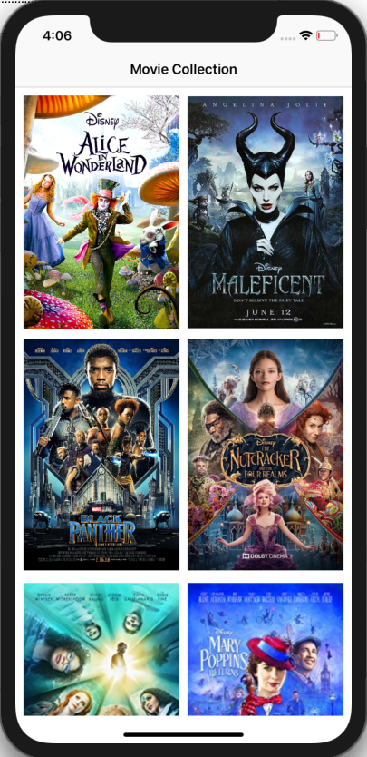
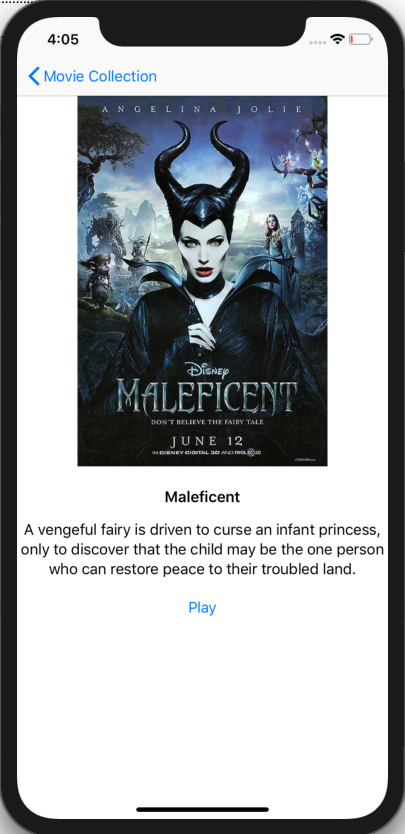
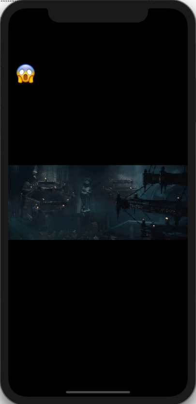
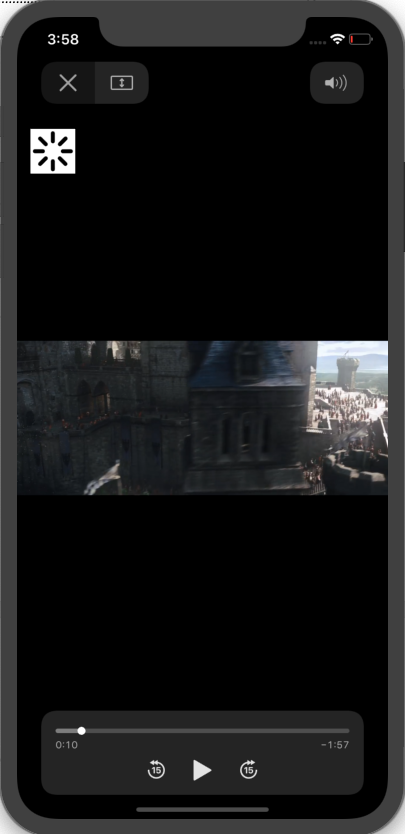

# User manual Leamoji

Name: Youssra Outelli  
Date: 21 november 2018  
Profession: iOS intern  
Company: Disney Streaming Services  

## Section 1 - Video List
The first screen of the app is the Video List. In this screen, you'll see all the movies that are available to watch at the moment. You can scroll up and down to see all the movies displayed. See screenshot below. 

_The movies on the screen are available at the time of making the screenshot_

## Section 2 - Video Details
To continue press on a movie you would like to watch. In this example i'll continue with the movie 'Maleficent'. When you select a movie, you'll see the video detail screen. On this screen are the details of the chosen movie. For all the movies, the movie poster, the title, the description and a play button will be visible. You could also turn the phone to landscape mode and details of the video will be displayed next to each other, for good readability. 

## Section 3 - Video Player
To continue to the video player, press the 'Play' button displayed at the bottom of the screen. You'll now see the video player. Press the play button to start the movie. In the top left of the screen you'll see the emoji corresponding to the scene. The emoji that you see is 5 seconds behind. That means if you see a shocking emoji right now, heads up in 5 seconds you'll see something scary 😱. 

When you pause the video or you are scrubbing, you'll temporarly see a buffer instead of an emoji. This is to make sure that the emoji you see when you're done scrubbing is the correct one. 

